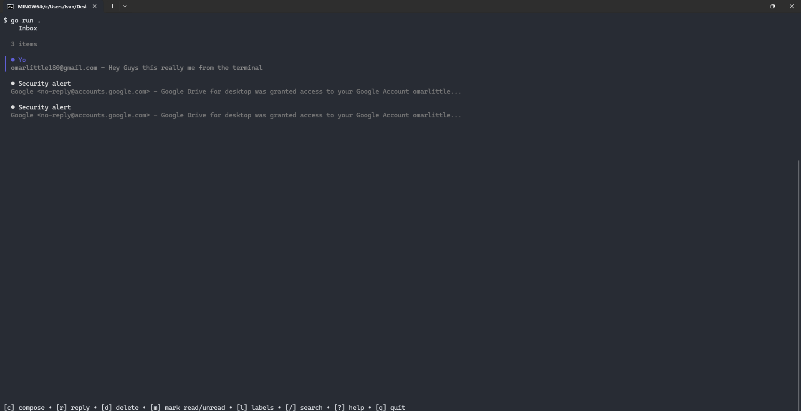
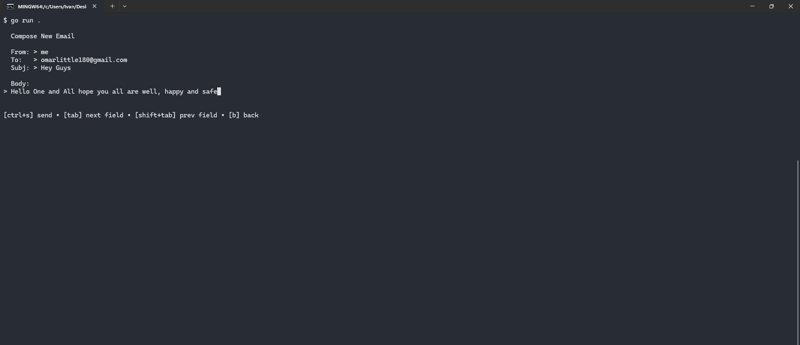
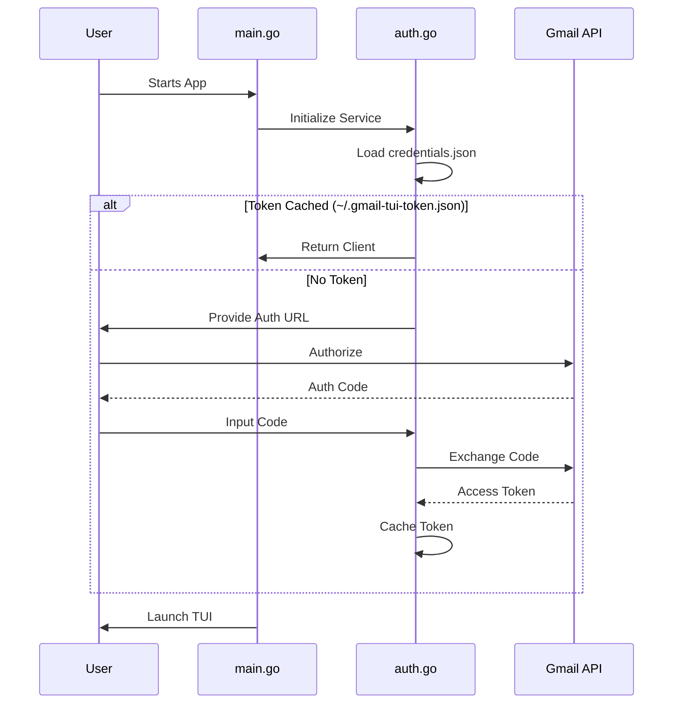

# Gmail TUI – Terminal Gmail Client

A feature-rich terminal interface for Gmail, combining the efficiency of CLI with the familiarity of Gmail's core functionality. Built with Go and Bubble Tea for a fast, keyboard-driven experience.

## ✨ Features

- 📬 **Inbox Management**: View, search, and organize emails with concurrent fetching for speed.
- ✏️ **Compose & Reply**: Full composition support including To, CC, BCC, and Subject fields.
- 🏷️ **Label System**: Navigate and manage Gmail labels/folders.
- 📎 **Attachment Support**: Add attachments (`ctrl+a`) to outgoing mail and download (`ctrl+d`) from incoming mail.
- 🔍 **Advanced Search**: Support for full Gmail search operators (e.g., `from:someone`, `is:unread`).
- ⚡ **Performance**: Local caching of message headers to minimize API round-trips.
- 🎨 **Modern UI**: Clean interface built with Lip Gloss and Bubble Tea.




## 🛠 Installation

### Prerequisites

- **Go 1.23.3+**
- A Google Account with Gmail enabled.
- Google Cloud Console Project with the Gmail API enabled.

### Quick Start

1. **Clone the repository:**
   ```bash
   git clone https://github.com/rdx40/gmail-tui
   cd gmail-tui
   ```

2. **Setup Credentials:**
   You must provide a `credentials.json` file in the project root.
   - Go to the [Google Cloud Console](https://console.cloud.google.com/).
   - Create a new project.
   - Enable the **Gmail API**.
   - Configure the **OAuth consent screen** (set user type to "External" and add your email as a test user).
   - Create **OAuth 2.0 Client IDs** (Application type: "Desktop App").
   - Download the JSON and rename it to `credentials.json` in the root of this repo.

3. **Run the application:**
   ```bash
   go run .
   ```
   *On the first run, it will provide a link to authorize the application. Follow the link, authorize, and paste the code back into the terminal.*

## ⌨️ Key Bindings

### Navigation
| Key | Action |
| --- | --- |
| `j`/`k` | Move selection up/down |
| `enter` | Open selected email |
| `b`/`esc` | Go back to previous view |
| `q`/`ctrl+c`| Quit application |

### Email Actions
| Key | Action |
| --- | --- |
| `c` | Compose new email |
| `r` | Reply to current email |
| `d` | Delete email (move to Trash) |
| `m` | Mark as read / unread |
| `/` | Focus search bar |
| `l` | Show labels / folders |
| `?` | Toggle help menu |

### Composition & Attachments
| Key | Action |
| --- | --- |
| `tab` | Next input field |
| `shift+tab` | Previous input field |
| `ctrl+s` | Send email |
| `ctrl+a` | Add attachment (while composing) |
| `ctrl+x` | Remove attachment (while composing) |
| `ctrl+d` | Download attachment (while viewing) |

## 🚀 Roadmap

- [ ] **Threaded Conversations**: Group messages by thread.
- [ ] **PGP Integration**: Secure email encryption/decryption.
- [ ] **Custom Themes**: Full support for user-defined color schemes.
- [ ] **Multi-Account Support**: Switch between multiple Gmail accounts.

## Architecture & Flow

Gmail TUI uses a standard Bubble Tea (Model-View-Update) architecture.


